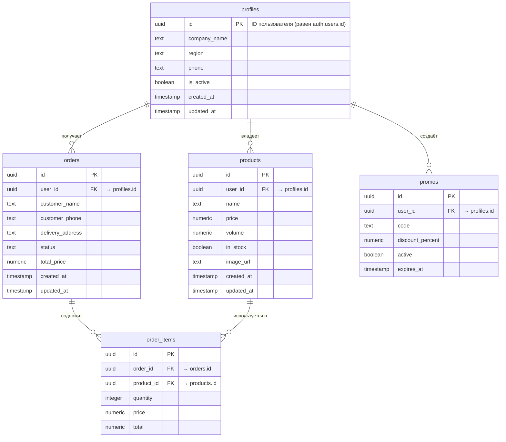

# 📘 Архитектура сущностей Hida Admin

## 🧩 Цель

Этот документ описывает базовые сущности и логику данных для **панели поставщика** в проекте **Hida Admin**.  
Админка предназначена **для поставщиков воды**, которые управляют своими товарами, заказами и настройками.  
Главная админка для владельца платформы (Hida) не входит в данный документ.

---

## ⚙️ Общая концепция

Каждый поставщик получает **свой личный кабинет**, доступ к которому осуществляется через **Supabase Auth**.  
Поставщик управляет только своими данными — товарами, заказами и промокодами.  
Доступ к данным фильтруется по `user_id` текущего авторизованного пользователя.

---

## 🧱 Основные сущности

### 1. profiles

> Расширение таблицы `auth.users`. Хранит дополнительную информацию о поставщике.

| Поле | Тип | Описание |
|------|-----|-----------|
| `id` | `uuid` | Совпадает с `auth.users.id` |
| `company_name` | `text` | Название компании |
| `region` | `text` | Регион доставки |
| `phone` | `text` | Контактный номер |
| `is_active` | `boolean` | Активен ли поставщик |
| `created_at` | `timestamp` | Дата создания |
| `updated_at` | `timestamp` | Дата обновления |

---

### 2. products

> Товары, добавленные поставщиком (например, бутыли, кулеры и т.п.)

| Поле | Тип | Описание |
|------|-----|-----------|
| `id` | `uuid` | Уникальный идентификатор |
| `user_id` | `uuid` | Владелец (поставщик, `profiles.id`) |
| `name` | `text` | Название товара |
| `price` | `numeric` | Цена |
| `volume` | `numeric` | Объём (литры) |
| `in_stock` | `boolean` | В наличии |
| `image_url` | `text` | Ссылка на изображение |
| `created_at` | `timestamp` | Дата создания |
| `updated_at` | `timestamp` | Дата обновления |

---

### 3. orders

> Заказы, поступающие поставщику от клиентов.

| Поле | Тип | Описание |
|------|-----|-----------|
| `id` | `uuid` | Уникальный идентификатор |
| `user_id` | `uuid` | Владелец (поставщик, `profiles.id`) |
| `customer_name` | `text` | Имя клиента |
| `customer_phone` | `text` | Телефон клиента |
| `delivery_address` | `text` | Адрес доставки |
| `status` | `text` | `pending` / `confirmed` / `delivered` / `cancelled` |
| `total_price` | `numeric` | Итоговая сумма |
| `created_at` | `timestamp` | Дата создания |
| `updated_at` | `timestamp` | Дата обновления |

---

### 4. order_items

> Позиции товаров в составе заказа.

| Поле | Тип | Описание |
|------|-----|-----------|
| `id` | `uuid` | Уникальный идентификатор |
| `order_id` | `uuid` | Ссылка на заказ |
| `product_id` | `uuid` | Ссылка на товар |
| `quantity` | `integer` | Количество |
| `price` | `numeric` | Цена за единицу |
| `total` | `numeric` | Общая стоимость позиции |

---

### 5. promos (опционально)

> Акции и промокоды для клиентов.

| Поле | Тип | Описание |
|------|-----|-----------|
| `id` | `uuid` | Уникальный идентификатор |
| `user_id` | `uuid` | Поставщик |
| `code` | `text` | Промокод |
| `discount_percent` | `numeric` | Процент скидки |
| `active` | `boolean` | Активен ли промокод |
| `expires_at` | `timestamp` | Дата окончания действия |

---

## 🧠 Логика доступа

Каждый поставщик видит **только свои данные**.  
Фильтрация выполняется по `user_id`:

```ts
supabase.from('orders')
  .select('*')
  .eq('user_id', currentUser.id);
```

---

## 🧭 Структура интерфейса

| Раздел | Описание |
|--------|-----------|
| **Главная (Dashboard)** | Краткая статистика по заказам и товарам |
| **Товары (Products)** | Список и управление товарами |
| **Заказы (Orders)** | История заказов, изменение статусов |
| **Промокоды (Promos)** | Управление скидками и акциями |
| **Настройки (Settings)** | Изменение информации о компании и контактах |

---

## 📦 Текущий стек

- **Фронтенд:** React + Zustand + TanStack Query
- **Бэкенд / БД:** Supabase (PostgreSQL)
- **Аутентификация:** Supabase Auth
- **Хранение файлов:** Supabase Storage (для изображений товаров)

---

## 🚀 Будущие расширения

| Возможное улучшение | Описание |
|----------------------|-----------|
| Глобальная админка Hida | Отдельная панель для владельца платформы (все поставщики, аналитика) |
| Курьеры | Привязка заказов к курьерам |
| Отзывы | Отзывы клиентов о поставщиках |
| Аналитика | Статистика по продажам и выручке |
| Роли и права | Несколько пользователей в одном аккаунте поставщика |

---

## 🧩 ER-диаграмма


