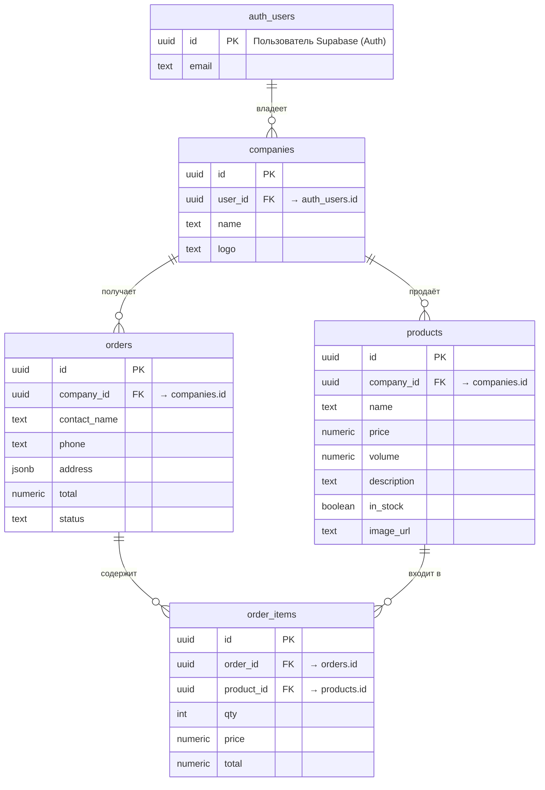

# 📘 Архитектура сущностей Hida Admin

## 🧩 Цель

Этот документ описывает структуру данных и связи для **панели поставщика** (Supplier Admin) в проекте **Hida Admin**.  
Панель предназначена для поставщиков воды, которые управляют своими товарами, заказами и данными компании.

---

## ⚙️ Общая концепция

- В Supabase регистрируется **пользователь (auth.users)**.
- Каждому пользователю соответствует **компания (companies)**.
- Поставщик (пользователь) управляет **только своими данными**.
- Безопасность обеспечивается через **RLS (Row Level Security)**.

---

## 🧱 Основные сущности

### 1. auth.users
> Системная таблица Supabase. Хранит учётные записи пользователей.

| Поле | Тип | Описание |
|------|-----|-----------|
| `id` | `uuid` | Уникальный идентификатор пользователя |
| `email` | `text` | Электронная почта |
| `created_at` | `timestamp` | Дата регистрации |

---

### 2. companies
> Компания, связанная с пользователем.

| Поле | Тип | Описание |
|------|-----|-----------|
| `id` | `uuid` | Уникальный идентификатор компании |
| `user_id` | `uuid` | Ссылка на владельца (auth.users.id) |
| `name` | `text` | Название компании |
| `logo` | `text` | Ссылка на логотип |
| `created_at` | `timestamp` | Дата создания |
| `updated_at` | `timestamp` | Дата обновления |

---

### 3. products
> Товары, добавленные поставщиком.

| Поле | Тип | Описание |
|------|-----|-----------|
| `id` | `uuid` | Уникальный идентификатор |
| `company_id` | `uuid` | Ссылка на компанию |
| `name` | `text` | Название товара |
| `price` | `numeric` | Цена |
| `volume` | `numeric` | Объём (литры) |
| `description` | `text` | Описание |
| `in_stock` | `boolean` | В наличии |
| `image_url` | `text` | Изображение товара |
| `created_at` | `timestamp` | Дата создания |
| `updated_at` | `timestamp` | Дата обновления |

---

### 4. orders
> Заказы клиентов, поступающие поставщику.

| Поле | Тип | Описание |
|------|-----|-----------|
| `id` | `uuid` | Уникальный идентификатор |
| `company_id` | `uuid` | Ссылка на компанию |
| `contact_name` | `text` | Имя клиента |
| `phone` | `text` | Телефон |
| `address` | `jsonb` | Адрес доставки |
| `status` | `text` | Статус (`pending`, `confirmed`, `delivered`, `cancelled`) |
| `total` | `numeric` | Итоговая сумма |
| `created_at` | `timestamp` | Дата создания |
| `updated_at` | `timestamp` | Дата обновления |

---

### 5. order_items
> Позиции товаров внутри заказа.

| Поле | Тип | Описание |
|------|-----|-----------|
| `id` | `uuid` | Уникальный идентификатор |
| `order_id` | `uuid` | Ссылка на заказ |
| `product_id` | `uuid` | Ссылка на товар |
| `qty` | `integer` | Количество |
| `price` | `numeric` | Цена за единицу |
| `total` | `numeric` | Общая стоимость позиции |

---

## 🔐 Безопасность (RLS)

Для всех таблиц включена Row Level Security.  
Каждый пользователь видит **только свои данные**, через связь `auth.uid() → companies.user_id`.

Пример политики для таблицы `products`:

```sql
CREATE POLICY "products_select_own"
ON public.products
FOR SELECT
USING (
  EXISTS (
    SELECT 1 FROM public.companies c
    WHERE c.id = company_id AND c.user_id = auth.uid()
  )
);
```

---

## 🧩 ER-диаграмма


